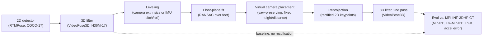

# Pose Reprojection Research

Experimental pipeline testing whether reprojecting 2D pose keypoints through a
leveled "virtual camera" — using an initial 3D lift as a depth scaffold — reduces
viewpoint-dependent error in a second 3D lifting pass, beyond what temporal
smoothing alone achieves.

## Hypothesis

> A first-pass 3D pose estimate contains sufficient depth information to
> approximately canonicalize 2D keypoints captured from an unfavorable camera
> viewpoint. Reprojecting those keypoints into a leveled virtual camera before a
> second 3D lifting pass may reduce viewpoint-dependent pose error, particularly
> errors caused by perspective distortion and foreshortening.

This is a cautious, unproven hypothesis, not a claim. Nothing below should be read
as evidence that it holds until explicitly marked "experimentally verified."

Clarification: "depth information" here means **relative joint depth** — the
per-joint depth recovered by the first-pass 3D lift (VideoPose3D/MotionBERT),
expressed relative to the pelvis root (root-centered, as both lifters output).
This is not a claim about absolute/metric depth accuracy: the lifter's scale is
nominally the H36M-style convention it was trained on, which is known to be a
domain mismatch for MPI-INF-3DHP data (see the existing caveat in
`scripts/evaluate_videopose3d_mpi_clip.py`), so relative depth *ordering/shape*
is what the rectifier relies on, not the pelvis-to-camera distance being
correct in real-world units.

## Pipeline



The dashed edge is the existing baseline path (2D → 3D → eval, already implemented
and evaluated). The solid path through leveling/rectification/re-lift is the
research question this repo is testing.

## Status

Split deliberately into three tiers so it's unambiguous what has actually been run.

### Implemented

- **2D detection**: RTMPose via `rtmlib` + ONNX Runtime GPU
  (`scripts/test_rtmlib_rtmpose_gpu.py`, `scripts/extract_rtmlib_keypoints_mpi_clip.py`).
- **2D smoothing**: `scripts/smooth_rtmpose_keypoints.py`.
- **3D lifting**: VideoPose3D
  (`scripts/run_videopose3d_fullseq_from_keypoints.py` and variants).
- **MPI-INF-3DHP data prep**: small-subset download
  (`scripts/download_mpi_small_subset.ps1`), GT extraction and camera-calibration
  parsing (`scripts/prepare_mpi_eval_clip.py`, `scripts/inspect_mpi_annotations.py`).
- **Metrics**: MPJPE, N-MPJPE, PA-MPJPE, PCK@150mm, AUC, 2D pixel error, velocity,
  acceleration error (`scripts/pose3d_metrics.py`).
- **Baseline evaluation**: raw RTMPose → VideoPose3D vs. MPI-INF-3DHP GT
  (`scripts/evaluate_videopose3d_mpi_clip.py`).
- **Visualization**: 2D skeleton overlay and 3D rotating-skeleton videos
  (`scripts/visualize_rtmpose_2d_video.py`, `scripts/visualize_videopose3d_3d_video.py`).
- **Virtual-camera rectifier** (new — this is the code central to the hypothesis
  above): `src/pose_reprojection/rectify/virtual_camera.py`, with a CLI
  (`scripts/rectify_virtual_camera.py`) and configs
  (`configs/rectify/coco17_mpi_default.yaml`,
  `configs/rectify/halpe26_phone_default.yaml`). Ported from a working prototype
  in a sibling research repo (`../Research/rectify.py`); the core geometry
  (leveling, RANSAC floor-plane fit from the feet, yaw-preserving virtual camera
  placement, reprojection) is unchanged from that prototype. Generalized in two
  ways so it runs against this repo's own data instead of only the original's
  AlphaPose/MotionBERT/phone-IMU assumptions:
  - `joint_format: coco17 | halpe26` — this repo's RTMPose/VideoPose3D pipeline
    uses COCO-17; the original prototype used Halpe-26. Both are supported via a
    config flag, converting through canonical H36M-17 internally either way.
  - `vertical_source: camera_extrinsics | imu_pitch_roll` — MPI-INF-3DHP provides
    calibrated camera extrinsics directly, so the "up" direction can be derived
    from the known camera rotation instead of requiring a phone-IMU pitch/roll
    reading (which the original prototype assumed).
- **Rectification ablation harness**: `scripts/evaluate_rectification_mpi_clip.py`
  compares a raw baseline against a rectified-and-relifted run on the same GT clip,
  reusing the same metric functions as the baseline evaluator so the two are
  directly comparable.
- **Identity POC scaffold**: `src/pose_reprojection/poc/` — a pass-through no-op
  method (`scripts/apply_poc.py --method identity`) used to sanity-check the
  POC/config/IO plumbing itself, independent of any actual pose-transform logic.

### Experimentally verified

- **Smoothing vs. raw** (MPI-INF-3DHP, S1/Seq1/cam0, 243-frame clip): smoothing
  strongly reduces wrist jitter and 3D acceleration error, but does not improve
  PA-MPJPE. This was an actual run of
  `scripts/evaluate_videopose3d_mpi_clip.py` against both raw and smoothed 2D
  input; see `outputs/eval/` (gitignored, regenerate locally) for the underlying
  JSON. Conclusion from this: future proof-of-concept methods, including
  rectification, should be compared against both raw and smoothed baselines, not
  raw alone.
- **Nothing else.** In particular, the virtual-camera rectifier above has **not**
  been run end-to-end against real MPI-INF-3DHP data in this environment — this
  development environment has no `torch`, no downloaded VideoPose3D checkpoint,
  and no downloaded MPI-INF-3DHP data. The rectifier's core geometry was checked
  with synthetic data (a hand-built standing-pose skeleton and a synthetic camera)
  to confirm it runs without error and produces plausible reprojected keypoints,
  and the CLI was checked to read/write the exact npz schema
  `run_videopose3d_fullseq_from_keypoints.py` expects, so the pipeline is wired
  correctly — but **no accuracy claim follows from that**. Do not read the
  smoothing finding above as evidence about rectification; they are unrelated
  interventions.

### Planned / TODO

- Run the actual rectification ablation on real data (see "Reproducing the
  rectification ablation" below) and report the resulting MPJPE/PA-MPJPE/accel
  error deltas here, explicitly labeled with the command used to produce them.
- Verify `vertical_source: camera_extrinsics`'s `world_up_axis` default (`[0,1,0]`)
  against a real MPI-INF-3DHP `camera.calibration` file — this is currently an
  unverified assumption (see comment in
  `configs/rectify/coco17_mpi_default.yaml`).
- **[Known evaluation gap, tracked as
  #1](https://github.com/michal-matusik/pose-reprojection-research/issues/1):**
  the rectified condition's re-lifted 3D pose is expressed in the constructed
  virtual camera's frame, not the GT camera's frame. Plain MPJPE/N-MPJPE (which
  assume a common coordinate frame) are therefore not yet meaningful for the
  rectified condition in `evaluate_rectification_mpi_clip.py` — only PA-MPJPE
  (which solves for rotation via Procrustes alignment) is currently trustworthy
  there. Needs resolving (documenting PA-MPJPE as primary, or rotating the
  re-lifted pose back into the GT frame before comparison) before drawing any
  conclusion from plain/N-MPJPE deltas.
- See "Planned ablations" below for the broader experiment set.

## Reproducing the rectification ablation

Once the environment has `torch`, a VideoPose3D checkpoint
(`scripts/download_videopose3d.ps1`), and the MPI-INF-3DHP small subset
(`scripts/download_mpi_small_subset.ps1`):

```bash
# 1-2: raw baseline (existing scripts, unchanged)
python scripts/extract_rtmlib_keypoints_mpi_clip.py ...
python scripts/run_videopose3d_fullseq_from_keypoints.py --input-keypoints <raw2d.npz> --output <raw3d.npz>

# 3: rectify
python scripts/rectify_virtual_camera.py --joint-format coco17 \
  --pose2d <raw2d.npz> --pose3d <raw3d.npz> \
  --intrinsics outputs/eval/mpi_s1_seq1_cam0_frames0_242_gt.npz \
  --config configs/rectify/coco17_mpi_default.yaml \
  --out outputs/rectify/rectified.npz

# 4: re-lift the rectified 2D (same script as step 2, new input)
python scripts/run_videopose3d_fullseq_from_keypoints.py \
  --input-keypoints outputs/rectify/rectified.npz \
  --output outputs/videopose3d_rectified/relifted.npz

# 5: compare raw vs. rectified against GT
python scripts/evaluate_rectification_mpi_clip.py \
  --gt outputs/eval/mpi_s1_seq1_cam0_frames0_242_gt.npz \
  --pred2d-raw <raw2d.npz> --pred3d-raw <raw3d.npz> \
  --pred2d-rectified outputs/rectify/rectified.npz \
  --pred3d-rectified outputs/videopose3d_rectified/relifted.npz
```

## Planned ablations

None of these have been run yet.

- **`virtual_cam_height` / `depth_factor` grid search** — the ported config
  (`configs/rectify/coco17_mpi_default.yaml`) carries `h_cam: 1.5`,
  `depth_factor: 2.0` unchanged from the source prototype, which itself notes
  these as a starting point, not a tuned value.
- **Leveling source**: `camera_extrinsics` (calibrated, MPI-INF-3DHP) vs.
  `imu_pitch_roll` (phone-IMU, for non-studio capture) — do the two leveling
  strategies agree when both are available for the same clip?
- **Size control on/off** (`size_control_enabled`) — does normalizing apparent
  subject scale across frames change lifting accuracy, independent of leveling?
- **Rectify-and-relift vs. rectify-only** — the ablation harness above always
  re-lifts; it would also be informative to check whether the reprojected 2D
  alone (without re-lifting) is already closer to a canonical view by some 2D
  metric.
- **More than one clip** — currently only MPI-INF-3DHP S1/Seq1/cam0 has GT
  prepared (`scripts/prepare_mpi_eval_clip.py`). A single clip cannot support any
  general claim; more subjects/sequences/cameras are needed before any result here
  is more than anecdotal.

## Repository structure

```text
configs/
  poc/identity.json                       # config for the identity POC
  rectify/
    coco17_mpi_default.yaml               # RTMPose+VideoPose3D+MPI-INF-3DHP (this repo's pipeline)
    halpe26_phone_default.yaml            # AlphaPose+MotionBERT+phone-IMU (matches original prototype's I/O)

scripts/
  download_mpi_small_subset.ps1
  download_videopose3d.ps1
  test_rtmlib_rtmpose_gpu.py
  check_mpi_video.py
  check_videopose3d_checkpoint.py
  extract_first_mpi_frame.py
  extract_rtmlib_keypoints_mpi_clip.py
  smooth_rtmpose_keypoints.py
  inspect_mpi_annotations.py
  prepare_mpi_eval_clip.py
  pose3d_metrics.py
  eval_summary.py                         # shared metric summaries (baseline + rectification eval)
  evaluate_videopose3d_mpi_clip.py        # baseline: raw/smoothed 2D -> 3D -> eval vs GT
  rectify_virtual_camera.py               # NEW: virtual-camera rectification CLI
  evaluate_rectification_mpi_clip.py      # NEW: raw vs. rectified ablation harness
  run_videopose3d_clip_from_rtmlib.py
  run_videopose3d_clip_fullseq_from_rtmlib.py
  run_videopose3d_fullseq_from_keypoints.py
  run_videopose3d_smoke_from_rtmlib.py
  visualize_rtmpose_2d_video.py
  visualize_videopose3d_3d_video.py
  apply_poc.py

src/pose_reprojection/
  core/
    keypoint_io.py                        # npz load/save with required-key validation
    joint_maps.py                         # shared COCO-17/H36M-17/Halpe-26 joint-index tables
  poc/
    identity.py, registry.py              # pluggable POC-method scaffold (sanity-check baseline)
  rectify/
    virtual_camera.py                     # NEW: core rectification algorithm

data/          # gitignored: raw/, processed/
checkpoints/   # gitignored: downloaded model checkpoints
outputs/       # gitignored: extracted keypoints, lifted 3D, eval JSON, visualizations
third_party/   # gitignored: mmpose, VideoPose3D
```

## Setup

Environment setup is currently Windows/conda-specific:
`setup_pose2d_windows.ps1` creates the `pose2d` conda env (Python 3.10, CUDA 11.8
PyTorch, OpenMMLab stack incl. `mmpose` v1.3.2). `requirements.lock.txt` is a
`pip freeze` snapshot of that environment for reference, not a cross-platform
requirements file.

The virtual-camera rectifier itself only needs `numpy`, `pyyaml`, and (optionally,
for smoothing) `scipy` — no torch/mmpose/onnxruntime dependency — so
`scripts/rectify_virtual_camera.py` and `scripts/evaluate_rectification_mpi_clip.py`
can be exercised independently of the full `pose2d` environment once you have 2D/3D
prediction files to feed them.
